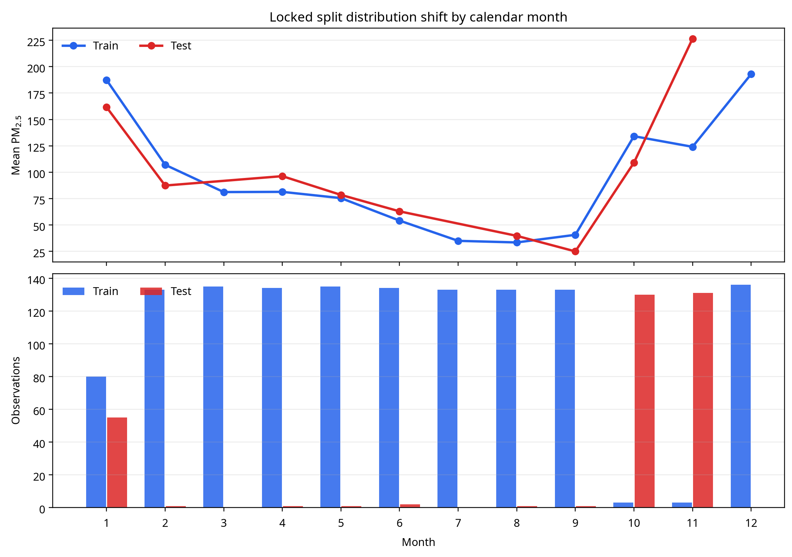

# Baseline PM2.5 Modeling Findings Report

**Repository:** `RidhimaKulashriz/PM2.5_ACM_Research_Work`  
**Analysis date:** 2026-08-15  
**Target:** `pm25`  
**Primary split:** `data/modeling/splits/train.csv` and `data/modeling/splits/test.csv`

## Executive conclusion

The baseline training workflow completed successfully for Ridge regression, Random Forest, and LightGBM. The data-integrity checks passed: the canonical dataset contains 1,615 rows, the split contains 1,292 training rows and 323 test rows, the train/test keys do not overlap, all four years appear in both partitions, and IIT Delhi remains training-only. These checks are recorded in [`data_integrity_validation.json`][1].

The model results should **not yet be treated as unbiased estimates of generalization**. Every model has a severe train-to-test R² gap, and all three models have negative test R². The principal explanation is a large calendar-month composition imbalance in the locked split rather than a simple failure of the algorithms. The test set contains 261 post-monsoon observations from October and November, while the training set contains only six observations from those months. Those months have materially elevated PM2.5 values, so the test set has a mean PM2.5 of 164.67 compared with 85.21 in training. The split is therefore year-balanced but not seasonally balanced.

> **Decision:** retain the current outputs as a diagnostic baseline, but regenerate or formally revise the holdout design with explicit month/season stratification before using the test metrics as publication-grade model performance.

## 1. Reproducibility and integrity validation

The training scripts use the existing canonical dataset and locked split as read-only inputs. The station identifier is excluded from predictors to reduce station memorization; all remaining numeric columns are used as environmental, temporal, spatial, and engineered predictors. Missing numeric values are median-imputed inside each modeling pipeline. Ridge uses standardization and regularization, Random Forest uses bounded depth and minimum leaf size, and LightGBM uses constrained tree depth, subsampling, and L1/L2 regularization.

| Validation item | Result |
|---|---:|
| Canonical master rows | 1,615 |
| Training rows | 1,292 |
| Test rows | 323 |
| Master keys unique | Passed |
| Train/test key overlap | 0 |
| Split union equals master keys | Passed |
| All four years in training | Passed |
| All four years in test | Passed |
| IIT Delhi train-only rule | Passed |

The validation result is reproducible with `python3 src/modeling/validate_data_integrity.py`. The full machine-readable output is in [`data_integrity_validation.json`][1].

## 2. Baseline model performance

The models were fitted on the 1,292-row training partition and evaluated once on the 323-row locked test partition. Five-fold shuffled cross-validation was performed on the training partition only. The overfitting indicator is defined as the absolute difference between train R² and test R².

| Model | Train R² | Test R² | Test MAE | Test RMSE | R² gap | CV R² mean ± SD |
|---|---:|---:|---:|---:|---:|---:|
| Ridge | 0.868 | -0.147 | 53.69 | 71.44 | 1.015 | 0.665 ± 0.374 |
| LightGBM | 0.998 | -0.290 | 52.03 | 75.77 | 1.288 | 0.929 ± 0.031 |
| Random Forest | 0.981 | -0.498 | 63.40 | 81.64 | 1.479 | 0.903 ± 0.035 |

Ridge has the least severe test degradation and the best test R² among the three models, although its performance is still unacceptable for a final predictive claim. LightGBM has the strongest within-training cross-validation result but generalizes poorly to the shifted holdout. This contrast is evidence that random folds within the training partition do not approximate the current test distribution.

The complete table is available in [`model_performance_summary.csv`][2]. Fitted pipelines are saved as `ridge.joblib`, `random_forest.joblib`, and `lightgbm.joblib` in the same results directory.

## 3. Distribution-shift investigation

The original hypothesis was that a higher concentration of winter months in the test partition might explain the reported PM2.5 shift. The month-level audit shows a different and more serious pattern: October and November are overwhelmingly assigned to the test set, while almost all other months are assigned to training.

| Month | Train rows | Test rows | Train mean PM2.5 | Test mean PM2.5 |
|---:|---:|---:|---:|---:|
| 1 | 80 | 55 | 187.41 | 161.64 |
| 2 | 133 | 1 | 107.05 | 87.40 |
| 3 | 135 | 0 | 81.21 | — |
| 4 | 134 | 1 | 81.40 | 96.29 |
| 5 | 135 | 1 | 75.48 | 78.53 |
| 6 | 134 | 2 | 54.18 | 62.95 |
| 7 | 133 | 0 | 35.01 | — |
| 8 | 133 | 1 | 33.49 | 39.74 |
| 9 | 133 | 1 | 40.72 | 25.00 |
| 10 | 3 | 130 | 134.13 | 109.05 |
| 11 | 3 | 131 | 124.07 | 226.47 |
| 12 | 136 | 0 | 192.95 | — |

The imbalance is visible in the seasonal aggregation as well. The test set contains 261 post-monsoon observations and 56 winter observations, whereas the training set contains only six post-monsoon observations and 349 winter observations. The overall target means are therefore substantially different:

| Partition | Rows | Mean PM2.5 | Median PM2.5 | Standard deviation |
|---|---:|---:|---:|---:|
| Training | 1,292 | 85.21 | 67.49 | 57.38 |
| Test | 323 | 164.67 | 145.63 | 66.80 |

The year-level counts are close to balanced, with 81 test observations in each year except for a one-row difference caused by the existing sampling allocation. Consequently, year balance alone does not prevent the observed target shift. The current split procedure samples within station-year groups but does not enforce month or season quotas, allowing the held-out observations to become concentrated in particular calendar months.

## 4. Interpretation and limitations

The negative test R² values mean that the predictions perform worse than a test-set mean baseline under the current holdout. This should not be interpreted as proof that all three algorithms are intrinsically unsuitable for PM2.5 prediction. The test partition is an atypical covariate and target distribution relative to training, especially for October and November. The high training R² values and strong within-training CV values also indicate that the models can fit the training distribution, but those diagnostics do not protect against this form of temporal composition shift.

The current result also highlights a methodological distinction. If the scientific question is **future-season or out-of-season forecasting**, the imbalance may represent a deliberate stress test, but the split must then be labeled as such and the training design must include an explicit temporal generalization protocol. If the scientific question is average performance across 2022–2025 station-months, the holdout should instead be stratified by month or season, while preserving station/year and IIT Delhi constraints.

## 5. Recommended next steps

First, keep the present outputs and split diagnostics as an audit record; do not overwrite the canonical master dataset. Second, construct a revised split with explicit month or season stratification, subject to the existing row-count, key-uniqueness, year-coverage, and IIT Delhi rules. Third, rerun the three baselines on the revised split and compare both random K-fold and spatially grouped cross-validation. Fourth, add a station-held-out evaluation, such as grouped cross-validation by station, before making claims about spatial transferability. Finally, report the current locked-split results as a sensitivity analysis rather than as the primary performance table.

## Generated implementation files

The implementation added the following files:

| File | Purpose |
|---|---|
| `src/modeling/train_baseline_models.py` | Trains Ridge, Random Forest, and LightGBM with leakage-safe pipelines and 5-fold CV. |
| `src/modeling/validate_data_integrity.py` | Validates the master dataset and locked split and writes audit JSON/CSV outputs. |
| `src/modeling/create_distribution_shift_figure.py` | Recreates the monthly train/test distribution-shift figure. |
| `data/modeling/results/` | Stores metrics, fitted models, feature importance, and split-distribution outputs. |
| `requirements.txt` | Adds LightGBM as an explicit dependency. |

## 6. Follow-up leakage and overfitting audit

A follow-up audit confirmed that the pipeline is leakage-safe at the row-key and preprocessing levels. The master, train, and test schemas match; there are no duplicate `(station, year, month)` keys; train/test key overlap is zero; the split union equals the master key universe; all four years appear in both partitions; and IIT Delhi remains train-only. The feature audit found no numeric predictor names containing `pm25` or `pm_25`, and no nonnumeric predictors were silently discarded. Median imputation and Ridge scaling are fitted inside each model pipeline rather than on the complete dataset.

The main risk is evaluation-design failure rather than direct leakage. The locked test partition contains 261 October/November observations and has mean PM2.5 of 164.67, while training contains only six October/November observations and has mean 85.21. This creates an approximately 79.46-unit target-mean difference. The expanded audit also compared random K-fold, station-year grouped, station grouped, and year grouped validation; the tree-based models remained strong under grouped validation, while Ridge was unstable, especially for station-held-out evaluation.

A target-free month/year-aware alternative split was generated without overwriting the locked split. It preserves 1,292 training rows, 323 test rows, all four years in both partitions, and the IIT Delhi train-only constraint. It assigns 26–27 test rows per month, resulting in train/test target means of 100.65 and 102.91. On this alternative split, Random Forest achieved test R² 0.920 with an absolute train/test R² gap of 0.058, and LightGBM achieved test R² 0.958 with a gap of 0.039. These results support treating the original negative locked-split scores as a composition-shift stress test rather than as definitive evidence that the algorithms fail.

The complete audit is documented in [`overfitting_leakage_audit.md`][6], with machine-readable outputs in [`overfitting_leakage_audit.json`][7], [`validation_strategy_comparison.csv`][8], and [`stratified_split_model_performance.csv`][9].

## References

[1]: ../data/modeling/results/data_integrity_validation.json "Data-integrity validation output"
[2]: ../data/modeling/results/model_performance_summary.csv "Baseline model performance summary"
[3]: ../data/modeling/results/season_distribution_analysis.csv "Season-level distribution analysis"
[4]: ../data/modeling/results/year_distribution_analysis.csv "Year-level distribution analysis"
[5]: ../data/modeling/results/station_distribution_analysis.csv "Station-level distribution analysis"
[6]: overfitting_leakage_audit.md "Leakage, split-integrity, and overfitting audit"
[7]: ../data/modeling/results/overfitting_leakage_audit.json "Machine-readable leakage and overfitting audit"
[8]: ../data/modeling/results/validation_strategy_comparison.csv "Validation strategy comparison"
[9]: ../data/modeling/results/stratified_split_model_performance.csv "Alternative split model performance"
